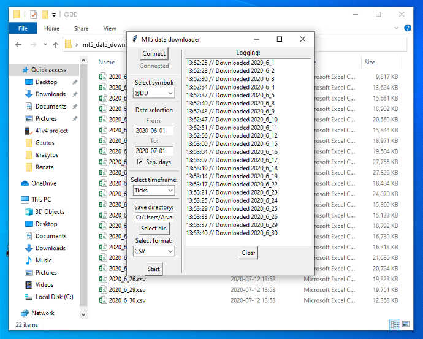

# mt5-data-downloader
Simple MT5 historical data downloader in Python

## Usage

```bash
# Install dependencies
pip install -r requirements.txt

# Run script
python downloader.py

# Tutorial
1) Press "Connect" button
2) Select available symbol
3) Specify "From" date (e.g. 2020-01-01)
4) Specify "To" date (e.g. 2020-02-01)
5) Check/uncheck "Sep. days" for separate days option
6) Select available timeframe
7) Select save directory by clikcing "Select dir." button
8) Select available save format
9) Press "Start" button

If everything is filled right - it will start downloading data, if not - you will get an error window with specified errors.

# Very important
Make sure you have the latest MT5 terminal version
```

# Demo

